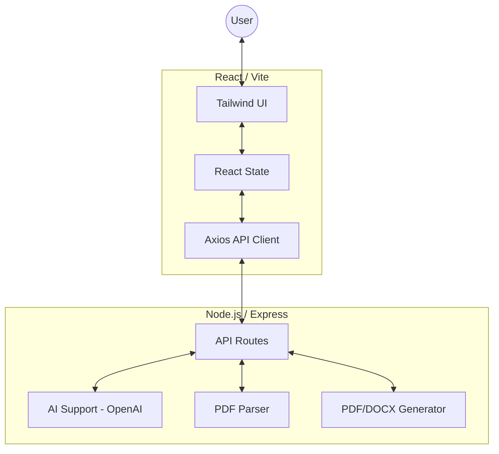
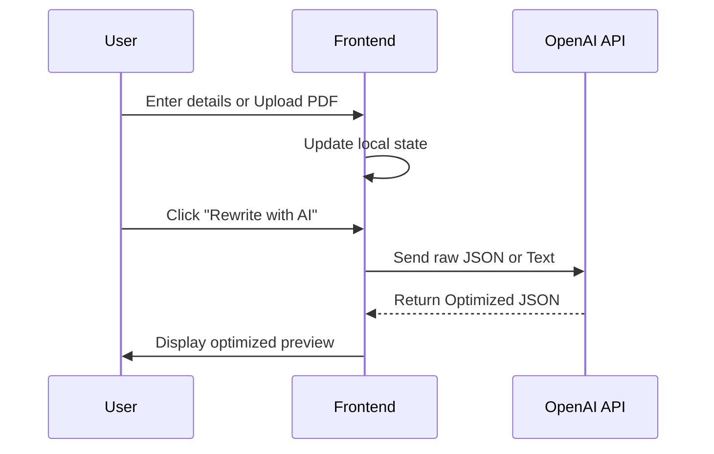
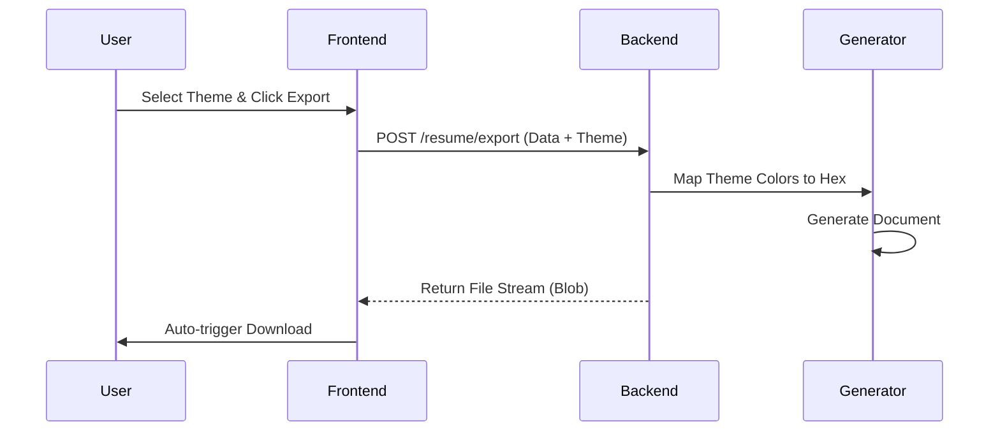

# AI Resume Pro - Professional Resume Creator

AI Resume Pro is a full-stack web application designed to help job seekers create recruiter-friendly, ATS-optimized resumes in minutes. It features real-time AI rewriting, 11 professional layouts, and instant export to PDF/DOCX.

## 🚀 Key Features
- **AI-Powered Optimization**: Enhance your professional profile using OpenAI's GPT-4o.
- **Dynamic Themes**: 11 colorful, high-impact layouts (Modern, Creative, Tech Dark, etc.).
- **Smart Import**: Upload your existing PDF resume to automatically populate the data.
- **Multiformat Export**: High-fidelity PDF and DOCX generation synced with your chosen theme.
- **Modern UI**: Smooth animations with Framer Motion and a sleek LinkedIn-inspired design.

---

## 🏗️ Architecture

The application follows a decoupled client-server architecture.



### Tech Stack
| Layer | Technologies |
| :--- | :--- |
| **Frontend** | React, Vite, TailwindCSS, Framer Motion, Lucide Icons |
| **Backend** | Node.js, Express, Multer, PDF-Parse |
| **AI** | OpenAI REST API (GPT-4o) |
| **Document Export** | PDFKit (PDF), Docx library (DOCX) |

---

## 🔄 Workflow

### 1. Resume Creation Flow


### 2. Export Flow


---

## 🔒 Privacy & Security

**AI Resume Pro** is designed with privacy as a priority.
- **No Persistence**: The application does not use a database. Your resume data is never stored permanently.
- **In-Memory Processing**: Resume text is processed ephemerally. Once you close your browser tab, your data is gone.
- **Automatic Cleanup**: Uploaded files are immediately deleted from the server after text extraction.
- **AI Data Handling**: Data sent to OpenAI for rewriting is governed by [OpenAI's API Privacy Policy](https://openai.com/policies/api-data-usage-policies). They do not use data submitted via API to train their models.

---

## 🛠️ Setup & Installation

### Prerequisites
- Node.js (v18+)
- OpenAI API Key

### Installation
1. Clone the repository:
   ```bash
   git clone https://github.com/your-username/resume-creator.git
   cd resume-creator
   ```

2. Setup Backend:
   ```bash
   cd server
   npm install
   # Create .env and add OPENAI_API_KEY=your_key
   npm run dev
   ```

3. Setup Frontend:
   ```bash
   cd ../client
   npm install
   npm run dev
   ```

## 🌐 Deployment
Refer to the [Deployment Guide](file:///C:/Users/Balu/.gemini/antigravity/brain/4b878c9c-68c5-49af-a309-89e4cd93b26d/deployment_guide.md) for instructions on hosting via Vercel, Render, or Azure.
